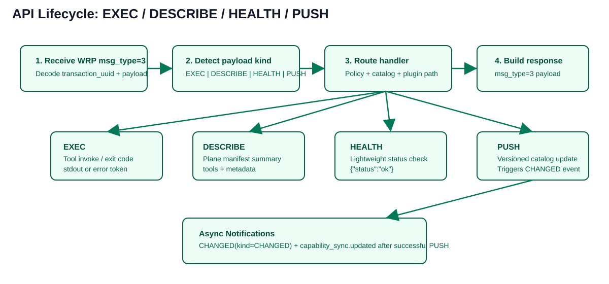
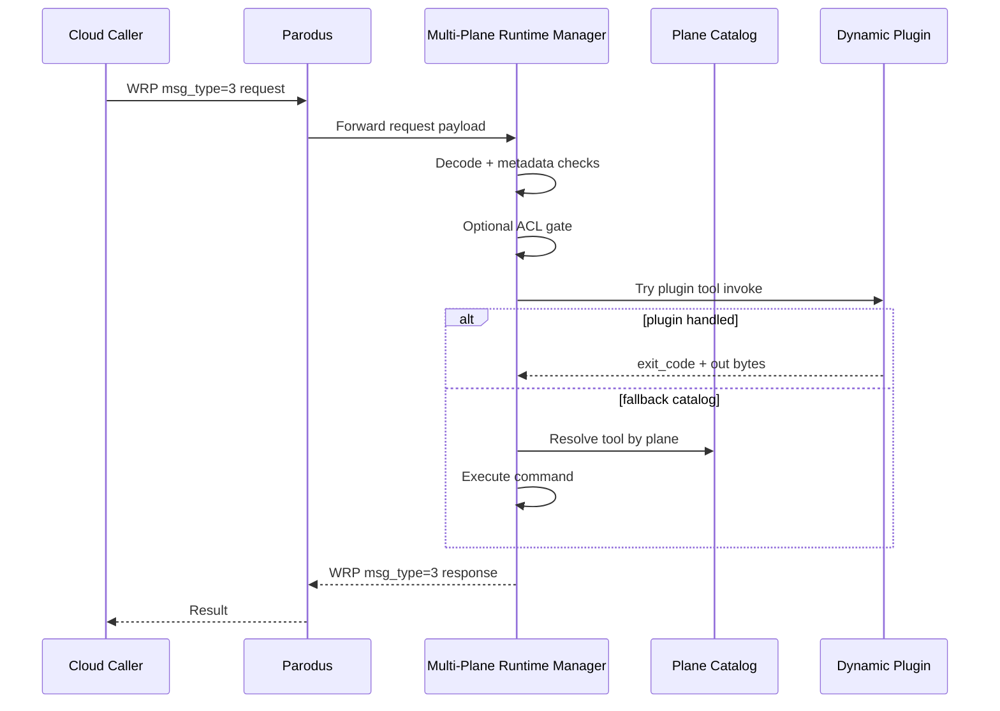
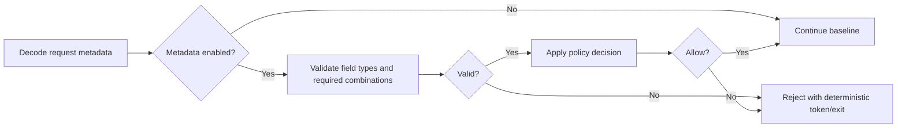
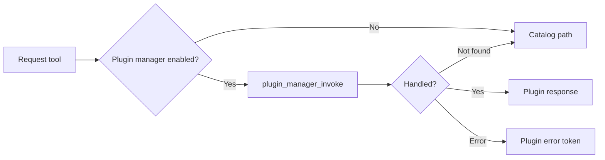

# API Calls, Workflows, and Functionalities — Detailed Guide

This is the detailed functional reference for external behavior and internal workflow.



---

## 1) End-to-end flow



---

## 2) External message APIs

### 2.1 WRP envelope types

- `msg_type=9` Registration
- `msg_type=10` Keepalive
- `msg_type=3` Request/Response

### 2.2 Payload request kinds

- `EXEC` (default when `kind` is omitted)
- `DESCRIBE`
- `HEALTH`
- `PUSH`

### 2.3 Async notifications

- `CHANGED` payload notification
- `capability_sync.updated` notification

---

## 3) EXEC API

### Request fields

| Field | Type | Required | Notes |
|---|---|---|---|
| `tool` | string | yes | Tool identifier |
| `plane` | string | recommended | Deterministic plane routing |
| `command` | string | optional | Expected for dynamic tools |

### Response fields

| Field | Type | Meaning |
|---|---|---|
| `tool` | string | Echoed tool name |
| `exit_code` | integer | Process/plugin outcome |
| `stdout` | bytes/string | Output or error token |

### Error token examples

- `tool not in catalog`
- `command blocked or missing`
- `access denied` (ACL-enabled builds)
- `ERR_PLUGIN_INVOKE`
- `ERR_PLUGIN_UNAVAILABLE`
- `ERR_PLUGIN_API_VERSION`

---

## 4) DESCRIBE API

Purpose:
- Return plane-aware tool manifest data for cloud discovery.

Behavior:
- With `plane`: returns one plane summary
- Without `plane`: returns all loaded plane summaries

Use case:
- Capability cache build, UI tool picker, pre-flight validation.

---

## 5) HEALTH API

Purpose:
- Lightweight service liveness endpoint.

Response:

```json
{ "status": "ok" }
```

Use case:
- Fleet heartbeat and rollout safety checks.

---

## 6) PUSH API (catalog update)

Purpose:
- Controlled per-plane catalog updates with explicit base/target versions.

Request shape (logical):
- `plane`
- `base_version`
- `target_version`
- `diff: {added, removed, modified}`

Workflow:
1. Decode and validate request
2. Locate target plane catalog
3. Validate base version match
4. Apply candidate diff
5. Validate candidate tool definitions
6. Persist catalog
7. Promote in-memory catalog
8. Emit `CHANGED` + capability sync notifications

---

## 7) Metadata policy workflow



Notes:
- Deterministic rejection is used for robust cloud error handling.

---

## 8) Plugin workflow



Key controls:
- enable flag
- conflict policy
- verify mode
- per-plane plugin directories
- reload mode (poll/notify/manual)

### 8.1 Example plugin in this repository

Reference source:
- `plugins/sample_multi_plane_runtime_manager_plugin.c`

Exposed example tools:
- `plugin_version` → returns `sample-plugin-v1`
- `plugin_echo` → returns `plugin-echo:<source>`

Why it matters:
- Demonstrates ABI-compatible multi-tool plugin shape
- Demonstrates request-aware plugin output
- Serves as baseline for custom domain plugins

Plugin developer documentation:
- [PLUGIN_DEVELOPER_UPDATE_GUIDE.md](PLUGIN_DEVELOPER_UPDATE_GUIDE.md)
- [../../plugins/README.md](../../plugins/README.md)

### 8.2 Plugin update workflow summary

1. Update plugin code and exported tools.
2. Build/test in Linux container.
3. Deploy plugin `.so` into target plane directory.
4. Trigger reload (poll/notify/manual).
5. Validate via cloud `EXEC` with explicit `plane`.

---

## 9) Plane-aware catalog loading

- Catalog directory is configurable.
- Each plane has an independent catalog filename and version.
- Missing one plane catalog does not block others.
- Tool ambiguity can occur if same tool appears in multiple planes and request omits plane.

### 9.1 Plane advantages (decision guide)

- `triage`: best for low-risk diagnostics and broad observability
- `management`: best for routine operational workflows with moderate permissions
- `control`: best for runtime policy/toggle operations during orchestrated control events
- `config-apply`: best for high-impact configuration mutation with strict governance

Use-case deep dive:
- [PLANES_AND_USE_CASES.md](PLANES_AND_USE_CASES.md)

---

## 10) Security/guardrail model

1. Static command validation at startup
2. Blocklist for high-risk commands
3. No-shell invocation model (argv-style)
4. Optional metadata policy gate
5. Optional ACL gate
6. Optional local-only policy for certain operations via compile/runtime posture

---

## 11) Operational runbook snippets

### Build + test in Linux container

```bash
docker compose run --rm mprm-ci
```

### Daemon smoke run

```bash
docker compose run --rm mprm-dev bash -lc "./scripts/container-smoke-daemon.sh"
```

### Manual interactive workflow

```bash
docker compose run --rm mprm-dev bash
./scripts/container-ci.sh
```

---

## 12) Diagram index

- Plane routing image: [plane-routing.svg](../images/plane-routing.svg)
- API lifecycle image: [api-lifecycle.svg](../images/api-lifecycle.svg)
- Sequence and flow charts: embedded Mermaid blocks in this file
