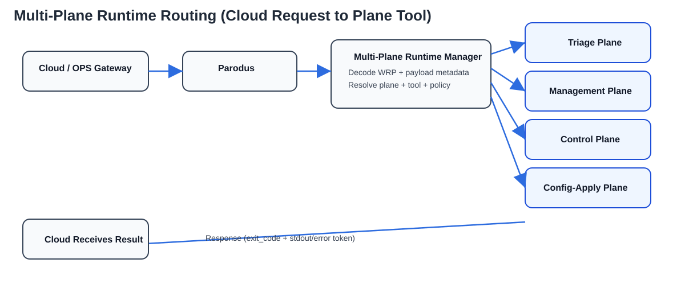

# Multi-Plane Runtime Manager — User Guide

## 1) What this service does

Multi-Plane Runtime Manager receives diagnostics requests from cloud through Parodus, resolves the requested tool from plane-specific catalogs and/or dynamic plugins, executes the tool, and returns the result.

Core capabilities:
- Plane-aware catalog model (`triage`, `management`, `control`, `config-apply`)
- Request types: `EXEC`, `DESCRIBE`, `HEALTH`, `PUSH`
- Dynamic plugin loading (optional)
- Metadata validation/policy pipeline (optional)
- ACL gate (compile-time option)

Reference architecture image:



---

## 2) Quick start (Linux container from macOS)

From repository root:

```bash
docker build -t multi-plane-runtime-manager:dev .
docker compose run --rm mprm-ci
docker compose run --rm mprm-dev bash -lc "./scripts/container-smoke-daemon.sh"
```

If you need an interactive shell:

```bash
docker compose run --rm mprm-dev bash
./scripts/container-ci.sh
```

---

## 3) Runtime files and paths

Default install/runtime paths:
- Binary: `/usr/local/bin/multi-plane-runtime-manager` (or your chosen prefix)
- Config: `/etc/multi-plane-runtime-manager/multi-plane-runtime-manager.conf`
- Catalog dir: `/etc/multi-plane-runtime-manager`

Per-plane catalog files (default names):
- `multi-plane-runtime-manager-triage-catalog.json`
- `multi-plane-runtime-manager-management-catalog.json`
- `multi-plane-runtime-manager-control-catalog.json`
- `multi-plane-runtime-manager-config-apply-catalog.json`

You can override these using config/env keys:
- `MULTI_PLANE_RUNTIME_MANAGER_CATALOG_DIR`
- `MULTI_PLANE_RUNTIME_MANAGER_CATALOG_FILE_TRIAGE`
- `MULTI_PLANE_RUNTIME_MANAGER_CATALOG_FILE_MANAGEMENT`
- `MULTI_PLANE_RUNTIME_MANAGER_CATALOG_FILE_CONTROL`
- `MULTI_PLANE_RUNTIME_MANAGER_CATALOG_FILE_CONFIG_APPLY`

---

## 4) Startup behavior

At startup, the service:
1. Loads runtime config
2. Loads per-plane catalogs from configured directory
3. Validates static tool commands
4. Initializes plugin manager (if enabled)
5. Binds/starts sockets and begins request loop

If one plane catalog is missing, other planes still load.

---

## 5) Request behavior overview

- `EXEC`: execute one tool and return `exit_code` + `stdout`
- `DESCRIBE`: return tool inventory by plane
- `HEALTH`: return service heartbeat status
- `PUSH`: submit a versioned catalog delta update

More details are in:
- [CLOUD_SIDE_USER_GUIDE.md](CLOUD_SIDE_USER_GUIDE.md)
- [API_WORKFLOW_FUNCTIONALITY_GUIDE.md](API_WORKFLOW_FUNCTIONALITY_GUIDE.md)

---

## 6) Dynamic plugin behavior (optional)

Enable/disable:
- `MULTI_PLANE_RUNTIME_MANAGER_PLUGIN_ENABLE=1|0`

Directories:
- Generic: `MULTI_PLANE_RUNTIME_MANAGER_PLUGIN_DIR`
- Per-plane:
  - `MULTI_PLANE_RUNTIME_MANAGER_PLUGIN_DIR_TRIAGE`
  - `MULTI_PLANE_RUNTIME_MANAGER_PLUGIN_DIR_MANAGEMENT`
  - `MULTI_PLANE_RUNTIME_MANAGER_PLUGIN_DIR_CONTROL`
  - `MULTI_PLANE_RUNTIME_MANAGER_PLUGIN_DIR_CONFIG_APPLY`

Reload:
- Poll mode via `MULTI_PLANE_RUNTIME_MANAGER_PLUGIN_POLL_INTERVAL_SEC`
- Linux notify/manual reload path available

### 6.1 Example plugin details (included in repository)

Source file:
- `plugins/sample_multi_plane_runtime_manager_plugin.c`

Exported tools:
- `plugin_echo`
- `plugin_version`

Behavior:
- `plugin_version` returns a fixed version string (`sample-plugin-v1`)
- `plugin_echo` returns a caller-aware message using request source (format: `plugin-echo:<source>`)

Why this sample is useful:
- Minimal ABI reference implementation for new developers
- Demonstrates host logging callback use (`host->log_fn`)
- Demonstrates multi-tool export from one shared object
- Demonstrates deterministic success/error return contract

### 6.2 New-developer plugin update flow

1. Copy sample plugin and rename tools for your domain.
2. Keep required ABI symbols unchanged (function names/signatures).
3. Add/update plugin tool handling in `diag_plugin_invoke()`.
4. Build and run container CI:
  - `docker compose run --rm mprm-ci`
5. Place plugin in target plane directory:
  - `.../plugins/triage` or `.../plugins/management` etc.
6. Reload plugins:
  - poll mode, notify mode, or `SIGHUP` manual trigger.
7. Validate from cloud with explicit `plane` and tool request.

Plugin author deep guide:
- [../../plugins/README.md](../../plugins/README.md)
- [PLUGIN_DEVELOPER_UPDATE_GUIDE.md](PLUGIN_DEVELOPER_UPDATE_GUIDE.md)

---

## 7) Operations checklist

Before production rollout:
- Verify each plane catalog is present and valid
- Confirm plugin directories exist and permissions are correct
- Decide static vs dynamic tool policy
- Decide ACL compile/runtime strategy
- Validate `PUSH` control process and version discipline
- Run smoke + CTest in Linux container

Plane advantage checklist:
- `triage`: fastest low-risk observability
- `management`: safer operational automation boundary
- `control`: runtime behavior governance without full config apply
- `config-apply`: explicit high-impact change channel with stronger controls

---

## 8) Troubleshooting quick map

- Build fails on macOS host dependencies: use container workflow
- Tool not found: check correct plane catalog and tool name
- Ambiguous tool: same tool exists in multiple planes without explicit request plane
- Plugin not invoked: check plugin enable flag, paths, and conflict policy
- `PUSH` rejected: check `base_version`, schema, and policy constraints
